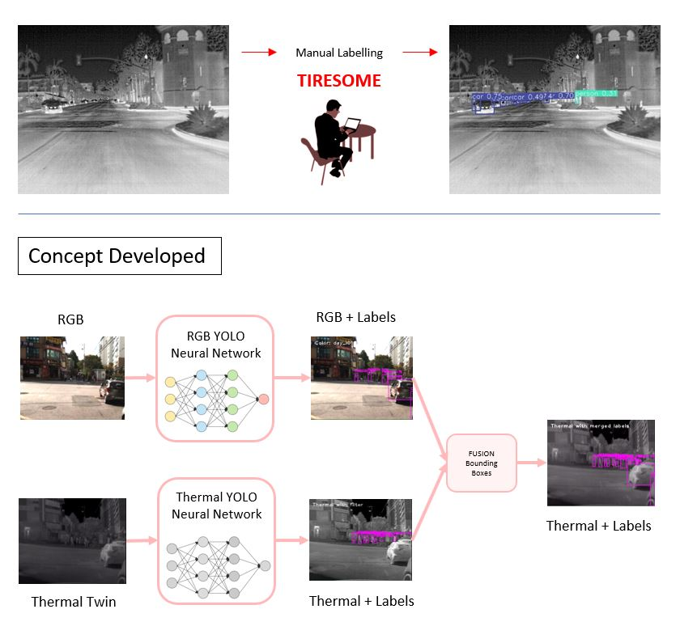
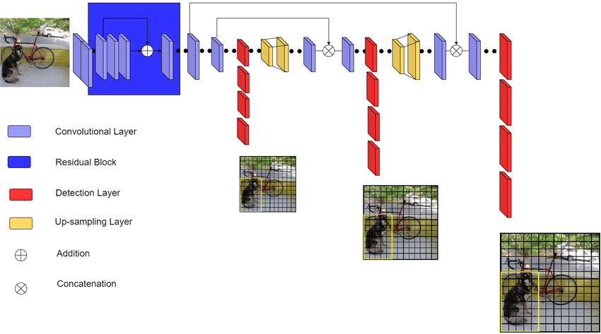
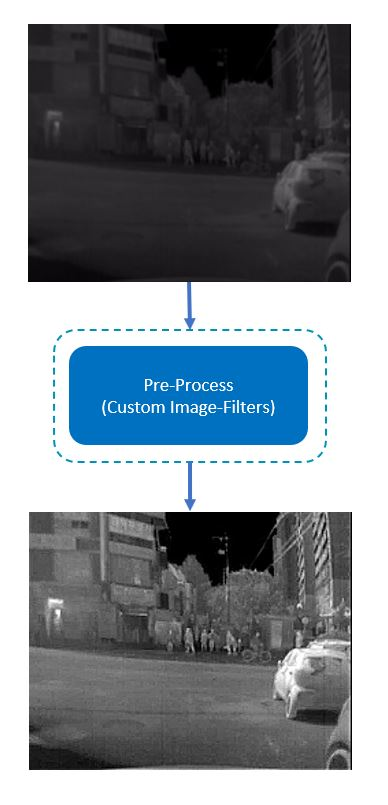
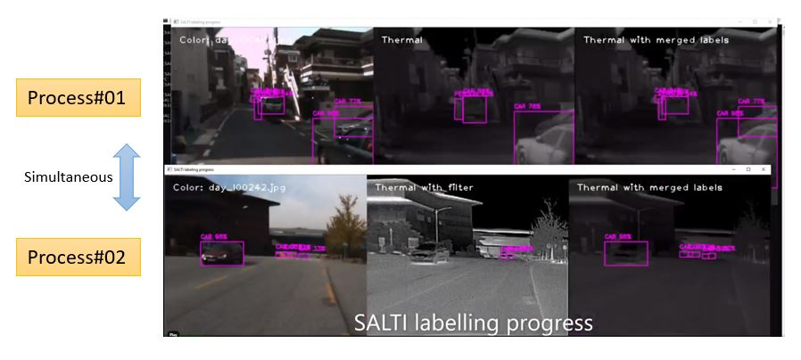
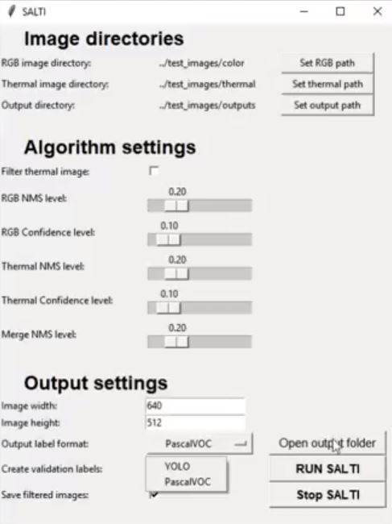
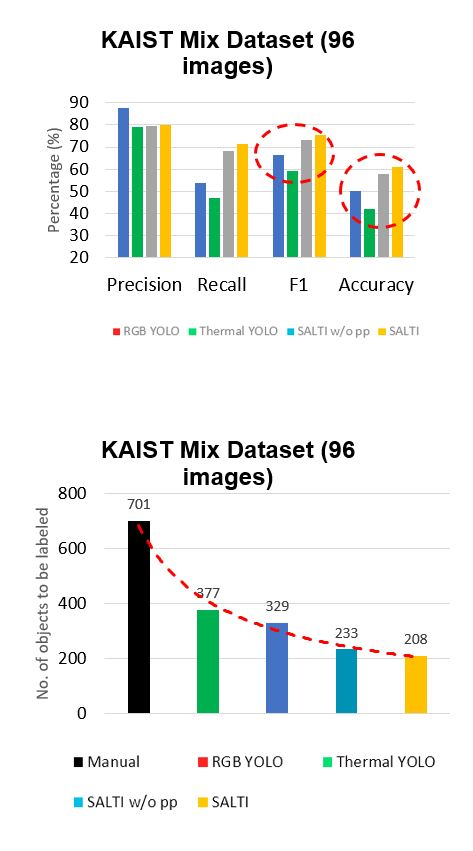

[comment]: <> (README file)

# Semi-Automatic Labelling of Thermal Images (SALTI)

Project implemented at Mobile Perception Systems Lab, seconded by TU/e. \
An overview is presented below. \
_(Source codes cannot be shared)_

## Project Overview:

 
 

## Neural Network Architecture:
YOLOv3 neural network architecture with Darknet-53 as encoder and prediction at 3 scales.

 
 

## Image Pre-Processing:

 
 

## Multi-processing:

 
 

## Dashboard as User-Interface:

 
 

## Results on KAIST Open Image Dataset:

 
 

